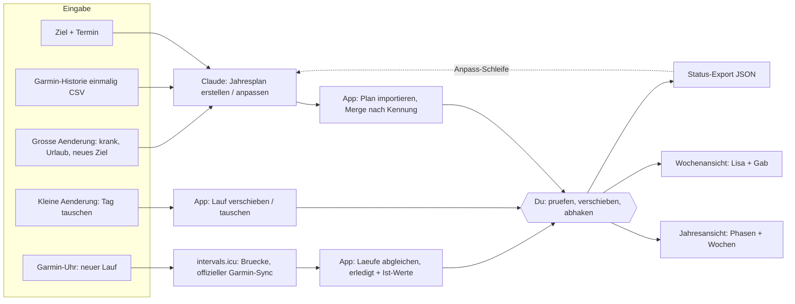

# Laufplaner: Jahresplan aus Claude in der App, Laeufe automatisch von Garmin

Stand: 2026-09-05 · Entscheidungen von Gabriel aus der Sitzung 2026-09-05 ·
Status: freigegeben, Umsetzung noch nicht begonnen.
Aufwand: Paket 1 = L, Paket 2 = M, Paket 3 = S (optional).

Dieses Dokument ist der komplette Bauplan fuer eine spaetere Sitzung. Es setzt
die Projekt-CLAUDE.md voraus (Stack, Drift-Waechter, Sync-Regeln) und wiederholt
sie nicht. Alles, was hier "Entscheidung" heisst, ist fix; alles unter "Offen"
darf die umsetzende Sitzung mit dem angegebenen Default selbst entscheiden.

---

## 0. Kurzfassung

- Ein sechster Reiter **"Laufen"** in der bestehenden App, mit drei Unterreitern
  **Woche / Jahr / Plan**. Bestehende Ansichten bleiben unangetastet.
- **Claude ist das Gehirn, die App das Schaufenster mit Stellschrauben:** Der
  Jahresplan entsteht im Gespraech mit Claude (Claude Code oder Claude Chat) als
  JSON-Datei in festem Format, wird in die App importiert und dort angezeigt.
  Kleine Aenderungen (Lauf verschieben, tauschen, abhaken) passieren in der App.
  Grosse Aenderungen (krank, Urlaub, neues Ziel) gehen zurueck an Claude.
- **Kreislauf:** Die App exportiert Plan + Status (erledigt, verschoben,
  Ist-Werte) im selben Format. Claude passt an, die App importiert erneut und
  fuehrt ueber die Kennungen zusammen (Merge) — Erledigtes bleibt erhalten.
- **Garmin-Anbindung ueber intervals.icu (Paket 2):** Beide haben eine Garmin.
  Der kostenlose Dienst intervals.icu ist offizieller Garmin-Partner; neue Laeufe
  landen dort automatisch, die App holt sie direkt aus dem Browser ab
  (CORS-Vorabfrage von der GitHub-Pages-Adresse am 2026-09-05 bestaetigt) und
  setzt den Haken samt Ist-Werten selbst.
- Pro Person ein eigener Plan. Wochenansicht zeigt beide, Jahresansicht eine
  Person.

## 1. Entscheidungen (fix)

| # | Entscheidung | Grund |
|---|--------------|-------|
| E1 | Erweiterung der bestehenden App, kein eigenes Projekt | Sync, Zwei-Nutzer-Modell, Offline, Backup und Deploy existieren; das Laufplan-Datenmodell ist ohnehin neu |
| E2 | Sechster Bottom-Tab "Laufen", Route `/running`, Unterreiter Woche / Jahr / Plan | Gabriels Wunsch (05.09.2026) |
| E3 | Plan-Erstellung ausserhalb der App (Claude), Import als JSON | Trainingswissen bleibt bei Claude; keine Planungs-Engine in der App |
| E4 | Ein Haken pro Lauf mit optionalem Ist-Wert; kein Lauf-Tracking | Ohne Status kann Claude nicht sinnvoll anpassen; Aufwand fuer den Nutzer: ein Tipp |
| E5 | Pro Person ein Plan (`userId` am Plan) | Unterschiedliche Ziele/Umfaenge; Wochenansicht zeigt trotzdem beide |
| E6 | Ein Dateiformat fuer beide Richtungen (Import und Status-Export) | Ein Schema, ein Pruefmodul, kein Uebersetzen |
| E7 | Garmin ueber die Bruecke intervals.icu, nicht direkt und nicht ueber Strava | Offizielle Garmin-API nur fuer Firmen mit Server; inoffizielle Bibliotheken brechen bei Login-Aenderungen; Strava-Bedingungen schraenken KI-Nutzung ein |
| E8 | Schluessel fuer intervals.icu liegen nur auf dem Geraet (localStorage), nie in `db.meta`, nie im Backup, nie im Repo | Wie der Standard-Nutzer: geraetelokal; Repo ist oeffentlich |
| E9 | Zwei Pakete, zwei Releases (v1.4.0 Laufplaner, v1.5.0 Anbindung) mit je eigenem Regressionscheck | Kleine Commits, Rollback pro Release; Datenmodell sieht Ist-Werte ab Paket 1 vor, damit Paket 2 keine Umstellung braucht |
| E10 | Laeufe sind in km, Minuten ODER Runden planbar | Backyard Ultra wird in Stunden und Runden gedacht, nicht nur in km |

## 2. Ablauf (Bild)



## 3. Datenmodell

### 3.1 Neue Dexie-Tabellen (Version 3, additiv, verlustfrei)

```js
// src/db/dexie.js UND single/src/db/dexie.js (Datei ist Drift-Ausnahme, beide anfassen)
db.version(3).stores({
  runPlans: 'id, userId, isActive',
  runSessions: 'id, planId, userId, date, [userId+date], externalId'
})
```

`public/sw-custom.js` oeffnet die DB ohne Versionsnummer (`indexedDB.open(name)`)
und ist von der neuen Version nicht betroffen (geprueft 2026-09-05).

### 3.2 Datensatz `runPlans`

```json
{
  "id": "plan-gab-2027",
  "userId": "user2",
  "name": "Backyard Ultra 2027",
  "goal": { "type": "backyard", "label": "Backyard Ultra", "date": "2027-09-04", "target": "12 Runden" },
  "phases": [
    { "id": "p1", "name": "Grundlage", "from": "2026-09-14", "to": "2026-12-20", "focus": "lockerer Umfang, Laufgewohnheit" }
  ],
  "weeks": [
    { "start": "2026-09-14", "phaseId": "p1", "targetKm": 30, "targetMinutes": 210, "note": "Einstieg" }
  ],
  "isActive": true,
  "planVersion": 1,
  "source": "claude",
  "createdAt": "2026-09-14T08:00:00.000Z",
  "updatedAt": "2026-09-14T08:00:00.000Z"
}
```

- `weeks[].start` ist immer ein Montag (ISO-Woche). `phases` und `weeks` liegen
  IM Plan-Datensatz (eine Firestore-Doc, ca. 5 KB fuer 52 Wochen). Laeufe liegen
  als eigene Datensaetze, damit Last-Write-Wins je Lauf greift.
- `goal.type`: `backyard | marathon | halfmarathon | ultra | fitness | other`.

### 3.3 Datensatz `runSessions`

```json
{
  "id": "plan-gab-2027-2026-09-16-a",
  "planId": "plan-gab-2027",
  "userId": "user2",
  "date": "2026-09-16",
  "type": "long",
  "title": "Langer Lauf",
  "description": "locker, alle 60 min essen ueben",
  "planned": { "km": 22, "minutes": 150, "loops": null },
  "status": "planned",
  "actual": null,
  "source": "plan",
  "externalId": null,
  "originalDate": null,
  "unplanned": false,
  "createdAt": "2026-09-14T08:00:00.000Z",
  "updatedAt": "2026-09-14T08:00:00.000Z"
}
```

- `date`: lokaler Kalendertag als `YYYY-MM-DD` (wie `getToday()` in
  `dateHelpers.js`; NIE `toISOString().slice(0,10)`, das verschiebt um UTC).
- `type`: `easy | long | backtoback | loops | tempo | hills | walk | strength | race | other`
  (`loops` = Simulation des Stundenrhythmus; `backtoback` = zweiter langer Lauf
  am Folgetag; `race` = Testwettkampf). Ruhetage sind KEINE Datensaetze.
- `planned`: mindestens eines von `km`, `minutes`, `loops` gesetzt, ausser bei
  `strength`, `race`, `other`.
- `status`: `planned | done | skipped`. `actual`: `{ km, minutes, avgHr, note }`
  oder `null`. `source` des Status: `plan | manual | intervals`.
- `externalId`: `"<athleteId>:<activityId>"` von intervals.icu (Idempotenz).
- `originalDate`: gesetzt, sobald in der App verschoben; Claude sieht so, was
  urspruenglich geplant war. `unplanned: true` = von der Uhr gekommen ohne
  passenden Plan-Lauf.
- `planId` darf `null` sein (ungeplanter Lauf ohne aktiven Plan).

### 3.4 Sync, Backup, Export

- `SYNCED` in `src/services/syncService.js` um `runPlans` und `runSessions`
  ergaenzen (nur Haupt-App; Single-Stub bleibt). Firestore-Rules sind
  Wildcard `/{collection}/{docId}` — keine Aenderung noetig.
- `src/utils/exportData.js` (geteilte Datei): beide Tabellen in `exportToJSON`
  und `IMPORT_TABLES` aufnehmen, sonst verliert ein Restore den Laufplan.
  CSV-Export bleibt Kraft-only.
- Jeder Schreibvorgang setzt `updatedAt` (Last-Write-Wins). Stores schreiben
  flache Kopien, nie Vue-Proxys (`DataCloneError`).

## 4. Dateiformat Laufplan (Vertrag zwischen Claude und App)

Lebt als `docs/laufplan-format.md` (Beschreibung fuer Menschen und Claude Chat)
plus `docs/laufplan-beispiel.json` (kleines Beispiel mit erfundenen Daten,
keine echten Termine oder Namen — Repo ist oeffentlich). Gleiches Format fuer
Import UND Status-Export.

```json
{
  "format": "fittrack-laufplan",
  "formatVersion": 1,
  "exportedAt": "2026-10-05T18:00:00.000Z",
  "plans": [
    {
      "id": "plan-gab-2027",
      "userId": "user2",
      "name": "…", "goal": { "…": "…" }, "phases": [], "weeks": [],
      "sessions": [
        { "id": "…", "date": "2026-09-16", "type": "long", "title": "…", "description": "…",
          "planned": { "km": 22, "minutes": 150, "loops": null },
          "status": "done", "actual": { "km": 21.4, "minutes": 146, "avgHr": 141, "note": "" },
          "source": "intervals", "originalDate": null, "externalId": "i123:456" }
      ]
    }
  ]
}
```

Regeln:
- `exportedAt`, `status`, `actual`, `source`, `originalDate`, `externalId` sind
  im Import optional (Claude darf sie mitschicken, z. B. nach eigener Analyse).
- Kennungen sind stabile Strings, eindeutig in der Datei. Claude BEHAELT beim
  Anpassen die Kennungen aus dem Export und vergibt fuer neue Laeufe neue
  (Konvention `<planId>-<datum>-<a|b>`). Das ist die Grundlage des Merge.
- Pruefung (Modul `src/utils/runPlanSchema.js`, reines JS ohne Abhaengigkeiten,
  wird von App-Import und `scripts/laufplan-pruefen.mjs` gemeinsam genutzt):
  Format + Version, `userId` in `USERS`, Datumsfelder gueltig und lokal,
  `phases[].from <= to`, `weeks[].start` = Montag, `type` aus der Liste,
  `planned`-Regel (3.3), Kennungen eindeutig. Fehlermeldung mit Pfad, z. B.
  `plans[0].sessions[12].date: kein gueltiges Datum (YYYY-MM-DD)`. Bei Fehlern
  wird NICHTS importiert.

## 5. Paket 1: Laufplaner (v1.4.0)

### 5.1 Schritte (Reihenfolge)

0. Rueckkehrpunkt-Commit; `.claude/pruefen.txt` anlegen (fehlt bisher, siehe
   Abschnitt 9), `privat/` ist bereits in `.gitignore`.
1. Format: `docs/laufplan-format.md`, `docs/laufplan-beispiel.json`,
   `src/utils/runPlanSchema.js`, `scripts/laufplan-pruefen.mjs`
   (`node .\scripts\laufplan-pruefen.mjs <datei>` → OK oder Fehlerliste, Exit 1).
2. Merge-Logik als reine Funktion `src/utils/runPlanMerge.js`:
   `computeImportDiff(localPlans, localSessions, file, today)` →
   `{ plansToPut, sessionsToPut, sessionIdsToDelete, summary }`. Dazu
   `scripts/laufplan-merge-test.mjs` mit den Faellen aus 5.4 (laeuft in Node
   ohne Dexie; Exit 1 bei Abweichung).
3. Datenbank + Sync + Backup (Abschnitt 3.1, 3.4).
4. Store `src/stores/running.js`: `loadAll`, `plansByUser`, `activePlan(userId)`,
   `sessionsForWeek(monday)`, `weekTarget(userId, monday)`, `phaseFor(userId, date)`,
   `moveSession(id, newDate)`, `swapSessions(idA, idB)`, `markDone(id, actual)`,
   `markSkipped(id, note)`, `resetToPlanned(id)`, `importPlanFile(json)`,
   `exportStatus(userIds)` → JSON-String, `deletePlan(planId)`.
   Reagiert auf `fitness-sync-changed` fuer `runPlans` / `runSessions` wie
   `stores/plans.js`.
5. Ansichten (5.3): `src/views/RunningView.vue` (TopBar + Unterreiter),
   `src/components/running/RunWeekView.vue`, `RunYearView.vue`, `RunPlanView.vue`,
   `RunSessionSheet.vue` (Modal), `RunSessionChip.vue`.
6. Navigation: Route `/running` (lazy) in `src/router/index.js`, Tab "Laufen"
   in `BottomNav.vue` (Icon: laufende Figur, SVG inline wie die anderen).
   Auf 360 px Breite pruefen: sechs Tabs, Labels `font-size-xs`; notfalls Label
   unter 340 px ausblenden (nur Icons) — bestehende Labels nicht umbenennen.
7. Spiegel: alle neuen Dateien nach `single/src/` kopieren (Single bekommt das
   Modul mit einem Nutzer, lokal ohne Sync), `dexie.js` in beiden Kopien,
   `npm run check:drift` gruen.
8. CHANGELOG, `package.json` 1.4.0, CLAUDE.md (Dateistruktur, Architektur-
   Hinweise: Laufplan-Kreislauf, Format-Vertrag, Merge-Regel), Tag, `/deploy`.

### 5.2 Dateien

Neu: `docs/laufplan-format.md`, `docs/laufplan-beispiel.json`,
`src/utils/runPlanSchema.js`, `src/utils/runPlanMerge.js`,
`scripts/laufplan-pruefen.mjs`, `scripts/laufplan-merge-test.mjs`,
`src/stores/running.js`, `src/views/RunningView.vue`,
`src/components/running/*.vue` (+ Kopien unter `single/src/`), `.claude/pruefen.txt`.

Geaendert: `src/db/dexie.js` + `single/src/db/dexie.js`,
`src/services/syncService.js`, `src/utils/exportData.js` (+ Kopie),
`src/router/index.js` (+ Kopie), `src/components/layout/BottomNav.vue` (+ Kopie),
`CHANGELOG.md`, `package.json`, `CLAUDE.md`, `verbesserungen.md`.

Nicht anfassen: `TrackingView`, `PlanningView`, `HistoryView`, `CatalogView`,
`sw-custom.js`, `notifications.js`, `firestore.rules`.

### 5.3 Oberflaeche je Unterreiter (Handy zuerst)

Unterreiter als Segment-Leiste unter der TopBar (Woche | Jahr | Plan); zuletzt
gewaehlter Unterreiter bleibt beim Tab-Wechsel erhalten (Modul-Variable reicht).

**Woche** (Standard)
- Kopf: `< KW 38 · 14.–20.09. >`, Knopf "Heute", darunter Phase des Standard-
  Nutzers ("Grundlage · Woche 3 von 14").
- Je Nutzer eine Zeile Wochenziel: "Gab 21 / 42 km" (erledigt / geplant) als
  schmaler Balken in Nutzerfarbe.
- Sieben Tageszeilen Mo–So (heute hervorgehoben). Je Tag pro Nutzer ein Chip in
  Nutzerfarbe: Typ-Symbol, Titel, Planwert ("22 km" / "2:30 h" / "6 Runden");
  erledigt = Haken + Ist-Wert; ausgelassen = durchgestrichen; verschoben =
  kleines Pfeil-Symbol. Leerer Tag = dezenter Platzhalter, kein Chip.
- Tipp auf Chip → `RunSessionSheet` (Modal, Android-Back schliesst): Details,
  Knoepfe **Erledigt** (Felder km / Minuten / Puls / Notiz optional),
  **Ausgelassen**, **Verschieben** (14 Tages-Chips ±7 Tage + Datumsfeld),
  **Tauschen mit …** (Laeufe desselben Nutzers derselben Woche),
  **Zurueck auf geplant**.
- Single-Variante: nur ein Nutzer → eine Chip-Spalte (ueber `USERS` iterieren).

**Jahr**
- Nutzer-Umschalter Lisa | Gab (Vorauswahl = Standard-Nutzer; in Single ohne).
- Ziel-Karte: Name, Termin, Tage bis dahin, Ziel ("12 Runden"), Plan-Version.
- Phasen als Abschnitte, darin Wochenzeilen: KW + Datum, Ziel (km oder h),
  Balken erledigt/geplant, aktuelle Woche hervorgehoben, vergangene Wochen mit
  Erfuellungsgrad. Tipp auf Woche → Wochenansicht springt dorthin.
- Ohne Plan: `EmptyState` mit Hinweis "Plan im Unterreiter Plan importieren".

**Plan**
- Je Nutzer eine Karte: aktiver Plan, Ziel, Version, importiert am, Anzahl
  Laeufe, naechster Lauf; Knopf "Plan loeschen" (Bestaetigung; Tombstones fuer
  Plan + Laeufe).
- **Import:** "Datei waehlen" (`input type=file accept=.json`, Muster aus
  `SettingsView`) ODER Textfeld "JSON einfuegen" → Pruefung → Vorschau
  "3 neu · 41 aktualisiert · 2 geloescht · 12 erledigte bleiben" → Bestaetigen →
  Anwenden in EINER Dexie-Transaktion → danach `pushRecord` je Datensatz und
  `pushBulkDelete` (Fehler landen in der bestehenden Retry-Queue). Ergebnis als
  Satz, Fehler zweistufig (menschlicher Satz + "Technische Ursache: …").
- **Status-Export:** Knoepfe "Kopieren" (`navigator.clipboard.writeText`, fuer
  Claude Chat am Handy), "Herunterladen" (`downloadFile` aus `exportData.js`),
  "Teilen" nur wenn `navigator.canShare({ files })` (Android Chrome). Export
  enthaelt standardmaessig beide Nutzer.
- Paket 2 haengt hier die Karte "Verbindung intervals.icu" an (6.2).

### 5.4 Import-/Merge-Regeln (Vertrag, per Test abgesichert)

Es gilt "heute" = `getToday()`; "Zukunft" = `date >= heute`.

1. Plan mit gleicher `id` vorhanden → Felder aus der Datei uebernehmen
   (`name`, `goal`, `phases`, `weeks`), `createdAt` behalten, `planVersion`
   um 1 erhoehen, `updatedAt` neu.
2. Plan mit neuer `id` fuer einen Nutzer, der schon einen aktiven Plan hat →
   neuer Plan wird aktiv; alter Plan bleibt (inaktiv), seine ZUKUENFTIGEN
   Laeufe mit Status `planned` werden geloescht (Tombstones), erledigte und
   ausgelassene bleiben als Geschichte.
3. Lauf-Kennung vorhanden, lokaler Status `planned` → `date`, `type`, `title`,
   `description`, `planned` aus der Datei; `originalDate` wird `null`, wenn die
   Datei ein anderes Datum liefert (Claude hat bewusst neu terminiert).
   Liefert die Datei `status`/`actual`, werden sie uebernommen.
4. Lauf-Kennung vorhanden, lokaler Status `done` oder `skipped` → lokaler
   Datensatz gewinnt komplett (Datei aendert nichts).
5. Lauf-Kennung neu → einfuegen (`status` aus Datei oder `planned`).
6. Lokaler Lauf desselben Plans fehlt in der Datei: Status `planned` UND
   Zukunft → loeschen (Tombstone); alles andere bleibt (vergangene, erledigte,
   ausgelassene, ungeplante).
7. Ungeplante Laeufe (`unplanned: true`) werden nie durch Import geloescht.
8. Die Datei wird vollstaendig geprueft, bevor irgendetwas geschrieben wird.
   Wochenansicht zeigt Laeufe ALLER Plaene eines Nutzers (Geschichte bleibt
   sichtbar), Jahresansicht nur den aktiven Plan.

Testfaelle fuer `scripts/laufplan-merge-test.mjs`: je Regel mindestens einer,
plus "leere Datei → Fehler, keine Loeschung", "Datei mit fremdem Nutzer →
Fehler", "Import derselben Datei zweimal → zweiter Lauf aendert nichts".

### 5.5 Akzeptanzkriterien Paket 1

- [ ] Beispiel-Datei importiert sich ohne Fehler; Vorschau-Zahlen stimmen mit
      der Datei ueberein; zweiter Import derselben Datei meldet "keine Aenderung".
- [ ] Fehlerhafte Datei (falsches Datum, unbekannter Typ, doppelte Kennung)
      wird mit Pfadangabe abgelehnt, nichts geschrieben.
- [ ] Wochenansicht zeigt beide Nutzer; Verschieben, Tauschen, Erledigt,
      Ausgelassen, Zurueck funktionieren und ueberleben Reload.
- [ ] Verschieben auf Handy A erscheint auf Handy B (Sync), auch nach Offline-
      Phase (Retry-Queue).
- [ ] Status-Export enthaelt Haken, Ist-Werte und `originalDate`; Re-Import einer
      von Claude geaenderten Datei behaelt Erledigtes (Regel 4) und loescht nur
      zukuenftige geplante Laeufe (Regel 6).
- [ ] Jahresansicht: Phasen, Wochenziele, Fortschritt, Countdown; Sprung in die
      Woche.
- [ ] JSON-Backup (Settings) enthaelt `runPlans`/`runSessions`; Restore stellt
      sie wieder her.
- [ ] `scripts/laufplan-pruefen.mjs` und `scripts/laufplan-merge-test.mjs` gruen;
      `npm run check:drift` und `npm run build:all` gruen.
- [ ] Sechs Tabs auf 360 px lesbar; Single-Variante zeigt das Modul mit einem
      Nutzer.
- [ ] Regressionscheck Kernfunktionen 1–5 aus `verbesserungen.md` laeuft.

## 6. Paket 2: Garmin-Anbindung ueber intervals.icu (v1.5.0)

### 6.1 Einrichtung (macht Gabriel bzw. Lisa selbst — Claude legt keine Konten an, gibt keine Zugriffe frei)

Anleitung als `docs/garmin-anbindung.md` (ohne persoenliche Daten):
1. Konto bei intervals.icu anlegen (kostenlos).
2. Einstellungen → Garmin Connect verbinden (Garmin-Login + Zustimmung). Ab
   jetzt kommt jeder neue Lauf automatisch an. Alte Laeufe kommen NICHT mit;
   fuer die Historie reicht der einmalige CSV-Export aus Garmin Connect (8.).
3. Einstellungen → Developer Settings → API-Key erzeugen; Athleten-Id notieren
   (Form `i123456`).
4. In der App: Laufen → Plan → "Verbindung intervals.icu" → Athleten-Id +
   Schluessel eintragen → "Verbindung testen". Jedes Handy traegt den
   Schluessel seines Besitzers ein; die Ist-Werte kommen ueber den normalen
   Sync auf das andere Handy.
5. Fuer das Skript (6.4): `privat/intervals.json` von Hand anlegen
   (`{ "user1": { "athleteId": "…", "apiKey": "…" }, "user2": { … } }`).
   Der Schluessel wird nie in den Chat geschrieben.

### 6.2 Technik

- Basis `https://intervals.icu/api/v1`, Auth HTTP Basic mit Benutzername
  `API_KEY` und dem Schluessel als Passwort. Laeufe:
  `GET /athlete/{athleteId}/activities?oldest=YYYY-MM-DD&newest=YYYY-MM-DD`.
  Erwartete Felder: `id`, `start_date_local`, `type`, `name`, `distance` (m),
  `moving_time` (s), `average_heartrate`. **Beim Bau gegen die API-Doku
  (`https://intervals.icu/api-docs.html`) und gegen eine echte Antwort pruefen**
  (erst mit dem Skript aus 6.4 eine Antwort ansehen, dann Felder festziehen —
  "am realen Datensatz kalibrieren").
- CORS: Vorabfrage (`OPTIONS`) von `https://jgc-coding.github.io` wurde am
  2026-09-05 mit `access-control-allow-origin` beantwortet. Den echten `GET` mit
  Auth im Browser als ERSTES verifizieren; scheitert er, faellt Paket 2 auf den
  PC-Weg zurueck (Skript 6.4 schreibt Ist-Werte in die Plan-Datei, Import setzt
  sie ueber Regel 3).
- Schluessel-Speicherung: `localStorage` unter `${db.name}:intervals:${userId}`
  als JSON `{ athleteId, apiKey }` (Muster `DEFAULT_USER_KEY` in
  `stores/auth.js`, try/catch). Eingabefeld `type=password`, Knopf "Entfernen".
  Nicht im Backup-Export, nicht in `db.meta`, nie loggen.
- Ausloeser: beim Oeffnen des Reiters Laufen, wenn online, Schluessel vorhanden
  und letzter Abgleich > 15 min her; zusaetzlich Knopf "Jetzt abgleichen".
  Zeitfenster: `oldest` = letzter Abgleich minus 3 Tage (mindestens heute minus
  30 Tage), `newest` = heute. Letzter Abgleich je Nutzer im localStorage.
- Fehler zweistufig: 401/403 → "Schluessel oder Athleten-Id stimmen nicht",
  Netz → "Offline oder Dienst nicht erreichbar, spaeter erneut", jeweils mit
  Zeile "Technische Ursache: HTTP 401 · ID abc123" (gleiche ID im Log
  `[FitTrack] [WARN] intervals: …`, keine Namen).

### 6.3 Abgleich-Regeln (reine Funktion `src/utils/runMatch.js`, Node-testbar)

1. Nur Aktivitaeten mit `type` in `Run, TrailRun, VirtualRun` (Walk/Hike nur fuer
   Plan-Typ `walk`). Lokaler Tag = erste 10 Zeichen von `start_date_local`.
2. `externalId` = `${athleteId}:${activity.id}`; schon vorhanden → ueberspringen
   (Idempotenz, Index `externalId`).
3. Kandidaten = Laeufe des Nutzers an diesem Tag ohne `externalId`, Status
   `planned` ODER `done` mit `source: manual` (Haken von Hand bekommt die
   Ist-Werte nachgetragen). Auswahl: kleinste relative Abweichung zwischen
   Planwert und Ist (km, sonst Minuten). Aktivitaeten chronologisch, jede nimmt
   genau einen Kandidaten.
4. Treffer → `status: done`, `actual: { km, minutes, avgHr }`, `source:
   intervals`, `externalId`. Kein Treffer → neuer Lauf `unplanned: true`,
   `type: easy`, `title` = Aktivitaetsname, `planned: {}`, `planId` = aktiver
   Plan oder `null`.
5. Nie etwas loeschen, nie einen Haken entfernen.
6. Ergebnis als Satz: "2 Laeufe abgeglichen, 1 ungeplanter Lauf ergaenzt".

### 6.4 Skript fuer Claude Code

`scripts/intervals-abruf.mjs --user user2 --von 2026-09-01 --bis 2026-09-30`
liest `privat/intervals.json`, holt die Laeufe, schreibt
`privat/laeufe-<user>-<von>-<bis>.json` (normalisiert wie `actual`) und druckt
eine Tabelle (Datum, Typ, km, Minuten, Puls). Node-`fetch`, keine Abhaengigkeit.
Zweck: tiefere Analyse in einer Anpassungs-Sitzung, Roh-Antwort ansehen (6.2).

### 6.5 Akzeptanzkriterien Paket 2

- [ ] Echter `GET` mit Schluessel aus der PWA (GitHub Pages) liefert Daten.
- [ ] Verbindungstest meldet Erfolg bzw. die zweistufige Fehlermeldung.
- [ ] Ein Lauf auf der Uhr erscheint nach dem Abgleich als erledigt mit
      Ist-Werten am richtigen Plan-Lauf; zweiter Abgleich aendert nichts.
- [ ] Lauf ohne Plan-Eintrag erscheint als "ungeplant"; Handhaken wird
      nachgetragen statt ueberschrieben.
- [ ] Schluessel taucht weder im Backup-JSON noch in Firestore noch im Log auf.
- [ ] `scripts/intervals-abruf.mjs` laeuft; `runMatch`-Tests gruen; Drift, Build,
      Regressionscheck gruen; Single-Variante baut (Anbindung dort erlaubt, ein
      Nutzer).

## 7. Paket 3 (optional, spaeter): Wochenbericht per Telegram

Windows Task Scheduler startet sonntags `claude -p` (Subscription, KEIN
`ANTHROPIC_API_KEY`) mit einer Prompt-Datei unter `privat/`: Skript 6.4 fuer die
letzten 7 Tage beider Nutzer, Vergleich mit der zuletzt erzeugten Plan-Datei
unter `privat/`, kurze Einschaetzung nach `privat/wochenbericht-<KW>.md` und als
reiner Text (keine Markdown-Zeichen) per Telegram-MCP. Keine Plan-Aenderung;
die laeuft weiter ueber eine Sitzung mit Gabriel. Nur nach Freigabe bauen.

## 8. Ersten Jahresplan erstellen (Inhalt, nach Paket 1)

Braucht von Gabriel (pro Person): Zielrennen (Backyard Ultra: Ziel in Runden,
Termin, Untergrund/Hoehenmeter der Runde), aktueller Wochenumfang und laengster
Lauf, verfuegbare Tage und Zeitfenster (Kinder!), Krafttage, Verletzungen,
Lisas Ziel (gleiches Rennen oder eigenes). Historie: Garmin Connect (Web) →
Aktivitaeten → Filter Laufen → Liste scrollen bis alles geladen → "CSV
exportieren" → `privat/garmin-historie-<user>.csv`.

Claude erzeugt `privat/laufplan-<user>-v1.json`, prueft mit
`node .\scripts\laufplan-pruefen.mjs`, Gabriel importiert. Einfachster Weg auf
die Handys: die Haupt-App am PC im Browser oeffnen (GitHub-Pages-Adresse),
mit dem gemeinsamen Konto anmelden, Datei importieren — der Sync bringt den
Plan auf beide Handys. Alternativ per Telegram-Bot als Dokument aufs Handy.

Leitplanken Backyard Ultra (fuer die erzeugende Sitzung): Phasen Grundlage →
Belastbarkeit (Back-to-back, Gehanteile) → Spezifik (Runden-Simulationen mit
Start zur vollen Stunde, Essen jede Stunde, ein Nachtlauf) → Taper. Umfang
maximal ~10 % pro Woche steigern, jede 3.–4. Woche Entlastung, ein Testlauf
(6 h oder 50 km) etwa 8–10 Wochen vor dem Ziel. Tempoarbeit klein halten
(Steigerungen, kurze Huegel), der Rest locker.

## 9. Pruefung, Regression, Release

- `.claude/pruefen.txt` (fehlt heute; anlegen in Schritt 0, Befehle mit `.\`):
  `npm run check:drift`, `node .\scripts\laufplan-pruefen.mjs .\docs\laufplan-beispiel.json`,
  `node .\scripts\laufplan-merge-test.mjs`. Build bleibt bewusst draussen (langsam).
- Vor dem Update: JSON-Backup beider Handys (Settings). Datenverlust-Check:
  Schema nur additiv, bestehende Tabellen unberuehrt → keine Warnung noetig,
  Backup trotzdem.
- Regression: Kernfunktionen 1–5 (`verbesserungen.md`), Sync-Punkt, Backup
  Export/Import, Notification-Knoepfe unveraendert (nicht angefasst).
- Release: `package.json` (einzige Versionsquelle, `__APP_VERSION__`),
  CHANGELOG, Tag `v1.4.0` bzw. `v1.5.0`, `/deploy`, Live-Manifest pruefen.
  PWA ist `autoUpdate`; nach dem Deploy App auf beiden Handys einmal neu laden.

## 10. Risiken und Stolperfallen

- Sechs Tabs auf schmalen Handys: erst am Geraet pruefen, dann ggf. Labels unter
  340 px ausblenden. Keine bestehenden Labels umbenennen.
- Beide Handys verschieben denselben Lauf offline → spaetere Aenderung gewinnt
  (Last-Write-Wins). Akzeptiert.
- Import schreibt bis ~300 Datensaetze → ebenso viele `pushRecord`-Aufrufe;
  Fortschritt anzeigen, Fehler laufen in die Retry-Queue.
- Kalendertage nur ueber `getToday()`-Muster (lokal), Wochen beginnen Montag
  (`getISOWeekNumber` vorhanden). DST-Wechsel testen (Ende Oktober).
- Vue-Proxys nie in Dexie schreiben; JSON aus `JSON.parse` ist bereits flach.
- Drift: jede neue Datei in beide Kopien; `dexie.js` und `syncService.js` sind
  Ausnahmen und werden getrennt gepflegt.
- Oeffentliches Repo: `privat/` bleibt ignoriert; Beispiel-Datei mit erfundenen
  Daten; Anleitungen ohne E-Mail, Ids oder Schluessel.
- intervals.icu: Feldnamen und CORS erst real pruefen (6.2), dann bauen.
- Kein `color-mix` in neuen Styles (alte WebViews) — statische rgba-Werte.

## 11. Nicht enthalten

Kein GPS-/Lauf-Tracking in der App, keine direkte Garmin-Anbindung, keine
Plan-Erstellung in der App, keine trainingswissenschaftlichen Warnungen beim
Verschieben, keine Benachrichtigungen fuer Laeufe, keine Pulszonen-Berechnung,
keine gemeinsame Wochenansicht mit Kraft-Tagen (sinnvoller spaeterer Schritt:
`workoutLogs` haben Datum, Kraft-Tage koennten als dritte Chip-Reihe erscheinen),
kein Bericht-Automat (Paket 3 nur nach Freigabe).

## 12. Offen (Default in Klammern, darf die umsetzende Sitzung entscheiden)

- Namen der Unterreiter (Woche / Jahr / Plan).
- Kompaktes "Jahresband" (52 Zellen in Phasenfarbe) ueber der Wochenliste
  (weglassen, wenn es eng wird).
- Tab-Label bei sehr schmalen Geraeten (Labels unter 340 px ausblenden).
- Ob Lisa auf dasselbe Rennen trainiert — Inhaltsfrage fuer Abschnitt 8, nicht
  fuer den Bau.
